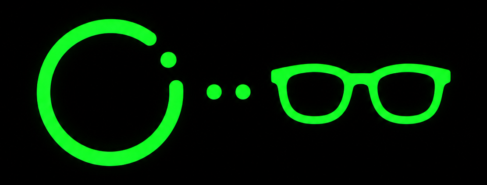
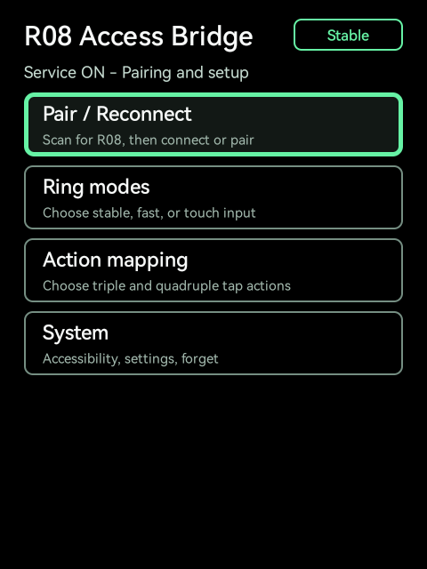
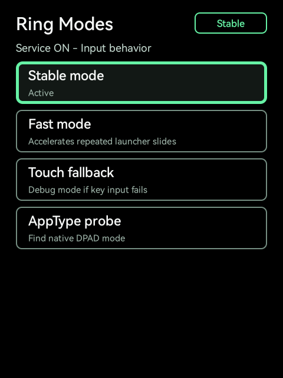
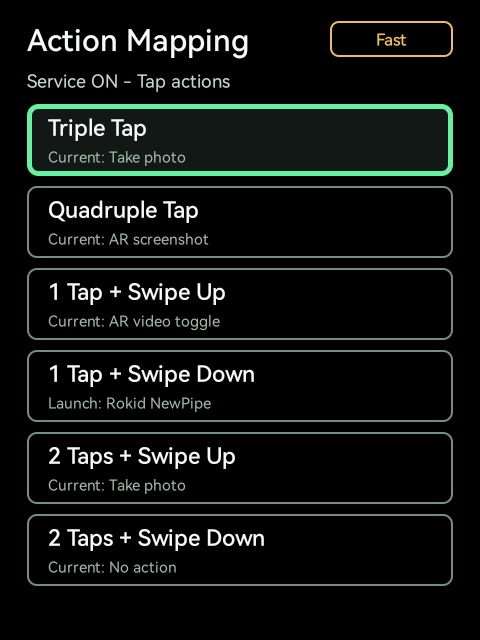
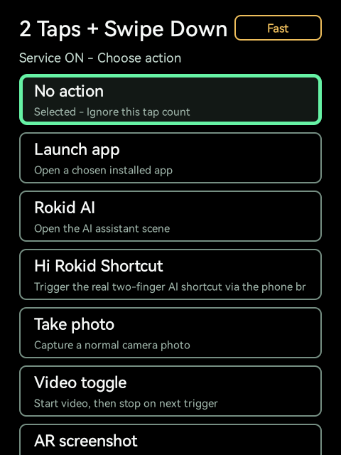
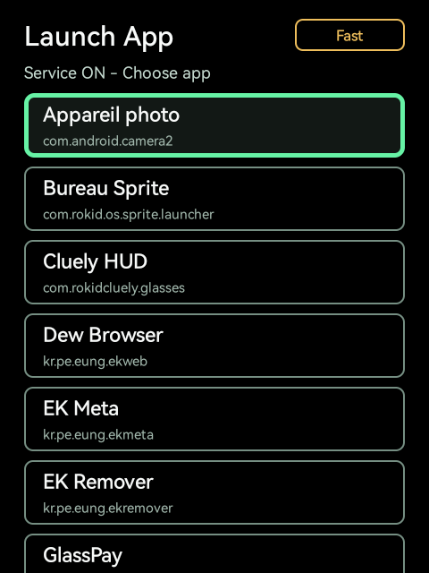
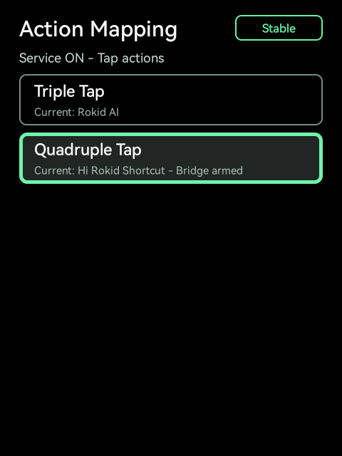
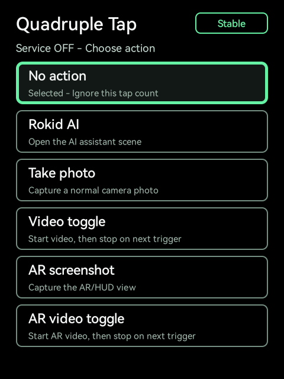
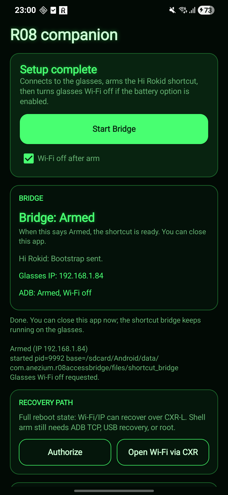

<h1 align="center">R08 Access Bridge</h1>

<p align="center">
  
</p>

<p align="center">
  <a href="https://github.com/Anezium/R08-Access-Bridge/releases/latest">
    
  </a>
  
  
  
</p>

<p align="center">
  <a href="https://ko-fi.com/M8R61ZTXMI" target="_blank">
    
  </a>
</p>

<p align="center">
  Turn an R08 smart ring into a stable, one-axis controller for Rokid glasses.
</p>

R08 Access Bridge lets an R08 smart ring act as a navigation controller for Rokid glasses. It pairs with the ring over Bluetooth LE, configures the ring into a usable input mode, then translates ring input into launcher navigation, app focus movement, activation, and Android Back actions through an Accessibility Service.

## Project Details

| Item | Value |
| --- | --- |
| App name | R08 Access Bridge |
| Package name | `com.anezium.r08accessbridge` |
| Companion app | R08 Companion |
| Companion package | `com.anezium.r08companion` |
| Minimum Android SDK | 28 |
| Companion minimum Android SDK | 31 |
| Target Android SDK | 34 |
| Primary target | Rokid glasses / YodaOS-Sprite, 480x640 portrait HUD |
| Input device | R08 BLE ring |

## What It Does

- Pairs or reconnects to an R08 ring over Bluetooth LE.
- Shows the latest R08 ring battery reading next to the glasses battery on the Rokid launcher.
- Lets ring swipes adjust the Rokid volume screen directly without the privileged bridge.
- Lets a single ring tap trigger a photo from the active Rokid camera page without the privileged bridge.
- Enables Stable mode by default using R08 `appType 1`, which emits media key events.
- Converts ring inputs into one-axis navigation suitable for Rokid glasses.
- Uses Android Accessibility to move focus, scroll, click, inject launcher swipes, and perform Back.
- Keeps the in-app HUD compact and readable on a 480x640 glasses display.
- Lets you switch between Stable, Fast, and Touch fallback behavior from one APK.
- Lets you remap triple tap, quadruple tap, and four tap+swipe combo gestures directly from the glasses UI, including launching any installed app.
- Wakes the glasses display on ring input and ignores the waking gesture, so ring actions never run blindly on a sleeping screen.
- Adds a phone companion that can arm the exact Hi Rokid shortcut bridge through Hi Rokid/CXR-L plus ADB Wi-Fi.
- Turns glasses Wi-Fi back off after arming by default to protect battery life.
- Provides an AppType probe screen for testing R08 output modes.
- Provides a safe Forget R08 flow to remove the saved Bluetooth bond and pair again.

## Screenshots

<p align="center">
  
  
  
  
  
</p>

<p align="center">
  
  
</p>

<p align="center">
  
</p>

## Controls

By default, the R08 ring is configured to emit media keys in Stable mode:

| Ring input | Meaning |
| --- | --- |
| Forward / next | Move forward through the launcher or current app focus |
| Backward / previous | Move backward through the launcher or current app focus |
| Single tap | Activate the current app, button, or focused item |
| Double tap | Android Back |
| Triple tap | Configurable action, no action by default |
| Quadruple tap | Configurable action, no action by default |
| 1 tap + swipe up / down | Configurable shortcut, no action by default |
| 2 taps + swipe up / down | Configurable shortcut, no action by default |

Inside R08 Access Bridge itself, double tap goes back to the previous screen. On the root screen, Back exits the app and returns to the launcher.

Triple tap, quadruple tap, and the combos ship unmapped so that single tap and double tap Back respond as fast as possible: the recognizer only waits for a longer gesture when one is actually mapped. Mapping a higher tap count or a combo adds a short (~350-500 ms) confirmation delay to the tap counts below it.

The `Hi Rokid Shortcut` action requests the exact two-finger long-press path when the privileged bridge is armed. A normal APK still cannot write `/dev/input` by itself, so the exact shortcut requires either the included phone/ADB bridge, a shell/root helper, or hardware that emits the matching Rokid input event.

Each mappable gesture can be set in the app to:

- No action
- Rokid AI
- Hi Rokid Shortcut
- Take photo
- Video toggle
- AR screenshot
- AR video toggle
- Launch app (opens a picker listing the apps installed on the glasses)

## Hi Rokid Shortcut Bridge

The exact Hi Rokid shortcut is the glasses touchpad `KEYCODE_SETTINGS` path. On tested hardware it is produced by raw input device `/dev/input/event1` with scan code `149`, which Rokid turns into `ACTION_SETTINGS_KEY`, `openAIFunction type: 2`, and CXR `Ai / Both_KeyDown`.

R08 Access Bridge cannot emit that raw input as a normal APK. The repo includes two bridge launchers:

- `tools/arm-r08-shortcut-bridge.ps1` for PC/ADB development.
- `phone` module, an Android companion APK that bootstraps through Hi Rokid/CXR-L, discovers the glasses IP, reads the Android 11+ Wireless Debugging dynamic port when available, then arms the same bridge over ADB Wi-Fi.

The bridge runs as the ADB `shell` user on the glasses. R08 writes shortcut requests into its app bridge folder, and the shell bridge converts each request into the real `sendevent` sequence.

The phone companion is intentionally phone-first: a dark monochrome green, phosphor-style control panel. After first-time setup, opening the companion auto-attempts re-arm, and the primary button remains available as `Re-arm bridge`.

PC/dev arm:

```powershell
.\tools\arm-r08-shortcut-bridge.ps1 -Serial 1901092534053723 -Action restart
```

### Phone companion — first-time setup (one-time)

1. Install `app-debug.apk` on the glasses and `phone-debug.apk` on the Android phone.
2. In `R08 Companion`, tap `Authorize` once and approve the Hi Rokid authorization screen.
3. Tap `Set up bridge`. The phone starts R08 Access Bridge through CXR-L, sends `r08.bootstrap.req`, and the glasses app opens Wi-Fi settings if it still needs a network.
4. Once the glasses have a Wi-Fi IP, the phone tries the latest Wireless Debugging port reported by the glasses. If Developer Options are still disabled, the glasses Accessibility Service opens Device Info and taps Build number first. If the phone is not paired yet, the flow opens Developer Options, enters Wireless Debugging, opens the pairing-code dialog, reads the code plus IP/port, and sends them back on `r08.bootstrap.res`.
5. The phone consumes that pairing code with KADB, using mDNS `_adb-tls-pairing._tcp` to recover the temporary pairing port when the Settings accessibility text is incomplete or ambiguous. It then connects to the dynamic Wireless Debugging port, installs/starts the shell bridge and Accessibility watchdog, maps quadruple tap to `Hi Rokid Shortcut`, grants `WRITE_SECURE_SETTINGS`, and provisions local ADB loopback self-arm for the glasses app.
6. `Wi-Fi off after arm` is enabled by default. Once the bridge is armed, the phone asks the glasses app/shell bridge to turn glasses Wi-Fi back off for battery life. The shell bridge also disables always-on Wi-Fi scanning. When the app shows `Bridge: Armed`, the user can close the phone app.
7. The phone and glasses must be on the same Wi-Fi/LAN for the ADB arm step. If the phone is on mobile data, VPN, guest Wi-Fi, or a different subnet, CXR-L may still report the glasses IP but ADB cannot connect.
8. If CXR-L is not available, expand `Advanced` → tap `LAN scan / arm` or enter the glasses IP manually and tap `Arm known IP`.
9. After the bridge is armed, quadruple tap on the R08 ring triggers the exact Hi Rokid shortcut.

### After a glasses reboot or force-stop

After first-time setup, the phone can recover the bridge automatically on launch:

1. Open `R08 Companion` on the phone.
2. Leave it open; it auto-attempts re-arm when a saved endpoint or Hi Rokid authorization is available. Tap `Re-arm bridge` only if you want to retry manually.

The phone connects to the saved endpoint using the already-authorized key pair, or asks the glasses over Hi Rokid/CXR to bring Wi-Fi/Wireless Debugging back first. No re-pairing is needed unless Android forgets the ADB authorization. After the phone re-arms, Wi-Fi and always-on scanning are turned off again.

The phone also provisions a hacha-style local loopback recovery path on the glasses: `persist.adb.tcp.port=5555`, a trusted ADB key, and the Accessibility watchdog script. After that provisioning, opening `R08 Access Bridge` directly on the glasses connects to `127.0.0.1:5555`, repairs `enabled_accessibility_services`, and restarts the watchdog even without the phone. This is the fallback for Rokid RG firmware 1.21.009, where folding a temple leg can force-stop the foreground third-party app and remove its AccessibilityService.

**Battery note:** glasses Wi-Fi is enabled only for the duration of the re-arm, then turned off along with always-on scanning, keeping the glasses in low-power operation.

**Ring battery note:** the glasses app reads the R08 battery through the QRing-compatible BLE notification path after reconnect and after real ring input, throttled to once every 4 minutes, then overlays the latest reading next to the glasses battery on the Rokid launcher.

The full CXR/Wireless Debugging pairing flow remains available under `Advanced → Recovery path` as a fallback for first-time setup or if the saved pairing expires. The multi-language Settings automator is only needed during first-time setup.

## Input Modes

The release APK now contains both launcher behaviors. There is no separate fast APK and focus-sync APK anymore:

| Mode | Behavior | Use when |
| --- | --- | --- |
| Stable | One launcher step per slide. This is the default. | Most users, especially when launcher focus can drift. |
| Fast | Uses boosted launcher swipes after repeated slides. | Your glasses keep visual focus and launched app aligned, and you want faster launcher movement. |
| Touch | Configures the R08 touch fallback profile. | Debug only, when key input is not usable. |

The current mode is shown in the top bar of the app so the active behavior is visible at a glance.

## Launcher Behavior

The Rokid launcher does not reliably respond to normal Accessibility scroll calls, so R08 Access Bridge injects small horizontal launcher swipes instead.

The launcher movement is tuned to keep the visible Rokid launcher selection and the ring action aligned:

- Each ring swipe moves one normal launcher step.
- Fast mode accelerates repeated launcher slides with boosted swipes instead of issuing a second tiny swipe that the Rokid launcher may ignore.
- Activation taps the visible center app in the launcher carousel.

This avoids relying on stale launcher accessibility focus. Fast mode can re-enable repeated-swipe acceleration from the `Ring modes` screen when a device handles it correctly.

Launcher swiping also no longer depends on the display staying awake. The Rokid firmware parks focus on an invisible 1x1 system window around screen off, which used to freeze launcher navigation and the selected-app label for users with short screen timeouts — while working fine for others. The app now detects that state and resolves the real launcher window, wakes the display on ring input, and swallows the gesture that caused the wake so nothing runs blindly on a dark screen. Ring navigation should now behave the same for everyone, regardless of the screen timeout.

## App Screens

### Home

- `Pair / Reconnect` scans for an R08 ring, connects to a bonded ring, or restarts the connection.
- `Ring modes` opens input mode settings.
- `Action mapping` opens triple and quadruple tap mapping.
- `System` opens permissions and reset actions.

### Action Mapping

- `Triple Tap` chooses what three taps trigger.
- `Quadruple Tap` chooses what four taps trigger.
- `1 Tap + Swipe Up/Down` and `2 Taps + Swipe Up/Down` choose the tap+swipe combo shortcuts.
- Picking `Launch app` for any gesture opens a picker listing the installed apps; the chosen app is then launched directly by that gesture.

### Ring Modes

- `Stable mode` restores the recommended `appType 1` media-key mode with one launcher step per slide.
- `Fast mode` keeps `appType 1` and enables launcher acceleration after repeated slides.
- `Touch fallback` configures `appType 4` touch-style fallback mode for debugging.
- `AppType probe` lets you test `appType 0` through `appType 7` and inspect key output in logs.

### System

- `Accessibility` opens Android Accessibility settings so the service can be enabled.
- `App settings` opens Android app details for Bluetooth permissions and system settings.
- `Forget R08` opens a confirmation screen and removes the bonded R08 ring when confirmed.

## Installation

Download the APKs from the GitHub Releases page:

[R08 Access Bridge releases](https://github.com/Anezium/R08-Access-Bridge/releases)

### Important: update and disconnect the ring first

Before pairing the ring with R08 Access Bridge, connect it to the official R08 Ring app and let the official app install any available ring firmware update.

This matters for Stable mode / R08 `appType 1`: before the ring firmware update, `appType 1` may only emit swipe / previous / next input. Tap and double-tap Back may not work at all. After updating the ring in the official app, disconnect it there, then reconnect it in R08 Access Bridge so Stable mode exposes the expected swipe, tap, and Back behavior.

After the firmware update, unbind or disconnect the ring from the official phone app before pairing it on the glasses. If the ring remains connected to the phone, the glasses may only see normal media-key behavior and R08 Access Bridge may not take over. If pairing still behaves oddly, forget the R08 ring from the phone's Bluetooth settings, or temporarily turn phone Bluetooth off while selecting `Pair / Reconnect` on the glasses.

Thanks to Reddit user `u/Rare_Wheel1907` for finding and confirming this fix.

For the normal ring controller, install the glasses APK:

```powershell
adb install -r R08-Access-Bridge-v1.5.0.apk
```

For the Hi Rokid shortcut bridge, also install the phone companion APK on an Android phone:

```powershell
adb install -r R08-Companion-v0.2.8.apk
```

After installing the glasses APK:

1. Open `R08 Access Bridge`.
2. Grant Bluetooth permissions if Android asks.
3. Open `System` -> `Accessibility`.
4. Enable the `R08 Access Bridge` accessibility service.
5. On the phone, unbind/disconnect the ring from the official R08 Ring app. If needed, forget it from phone Bluetooth.
6. Return to the glasses app and select `Pair / Reconnect`.
7. Keep the R08 ring nearby and allow pairing if Android asks.
8. Stay in `Stable mode` for the safest launcher behavior, or use `Ring modes` -> `Fast mode` if you want launcher acceleration.
9. For the exact Hi Rokid shortcut on quadruple tap, arm the bridge from the phone companion or the PC helper.

After installing the companion APK:

1. Open `R08 Companion`.
2. Tap `Authorize` once and approve the Hi Rokid authorization screen.
3. Tap `Start Bridge`.
4. When the status reads `Bridge: Armed`, close the companion app. The shell bridge keeps running on the glasses until it is disabled or the glasses reboot.

### Run the phone companion at least once (accessibility watchdog)

This step is not optional anymore, even if you never use the Hi Rokid shortcut.

Rokid RG firmware 1.21.009 force-stops third-party apps and strips their Accessibility service when a temple leg is folded. Without recovery, ring control silently dies the first time you fold the glasses, and the accessibility service has to be re-enabled by hand.

R08 Access Bridge recovers through an accessibility watchdog that runs on the glasses as the ADB `shell` user, but a normal APK cannot install that watchdog by itself: it has to be provisioned from outside. Arming the bridge from `R08 Companion` (or the PC helper script) once does exactly that — it installs and starts the watchdog and provisions the local loopback self-arm path. After that one-time arm:

- The watchdog restores the accessibility service automatically after a firmware force-stop.
- Opening R08 Access Bridge on the glasses can self-repair through `127.0.0.1:5555` even without the phone.

The companion shows the watchdog state on its main screen so you can confirm the glasses are protected.

## Build From Source

Requirements:

- Android SDK with API 36 installed.
- Java 17.
- ADB access to the Rokid glasses for install/testing.
- A phone with Hi Rokid Global installed for the CXR-L companion flow.

Build a debug APK:

```powershell
.\gradlew.bat assembleDebug
```

Run lint:

```powershell
.\gradlew.bat lintDebug
```

Install on a connected device:

```powershell
adb install -r app\build\outputs\apk\debug\app-debug.apk
adb install -r phone\build\outputs\apk\debug\phone-debug.apk
```

The current project does not include a private release signing configuration. GitHub release APKs are debug-signed unless a release signing setup is added.

## Debugging

Useful log tags:

```powershell
adb logcat -v time -s R08Bridge:D R08Ble:D R08Navigator:D R08Activity:D R08RokidSystem:D *:S
```

Probe the R08 media-key profile / `appType 1` from ADB:

```powershell
adb shell am start -n com.anezium.r08accessbridge/.MainActivity --ei probe_app_type 1 --ez exit_after_probe true
```

Probe another app type:

```powershell
adb shell am start -n com.anezium.r08accessbridge/.MainActivity --ei probe_app_type 4 --ez exit_after_probe true
```

## Privacy And Permissions

R08 Access Bridge requests:

- Bluetooth permissions for scanning, pairing, reconnecting, and configuring the R08 ring.
- Location permission on Android versions where Bluetooth scanning requires it.
- Accessibility permission so ring input can control launcher/app navigation.
- Wake lock to keep ring connection maintenance reliable.

R08 Companion requests:

- Internet/network access so it can connect directly to the glasses ADB TCP port on the local Wi-Fi network.

## Notes

- Stable mode is the recommended default.
- Fast mode is optional launcher acceleration for devices where visual focus and launched app stay aligned.
- Touch fallback exists for experimentation when media-key mode is not usable.
- The app lets the ring's touch sleep timer work instead of sending an infinite wake command every few seconds, which keeps idle ring power use lower.
- Native DPAD output was not observed in the tested `appType 0..7` range, so the app bridges media/touch outputs into navigation behavior.
- The exact Hi Rokid two-finger shortcut is available through the bridge-backed `Hi Rokid Shortcut` action; without the bridge, normal APK permissions are not enough to emit the raw input event.
- The app is designed for the Rokid glasses HUD, not a phone-first UI.
